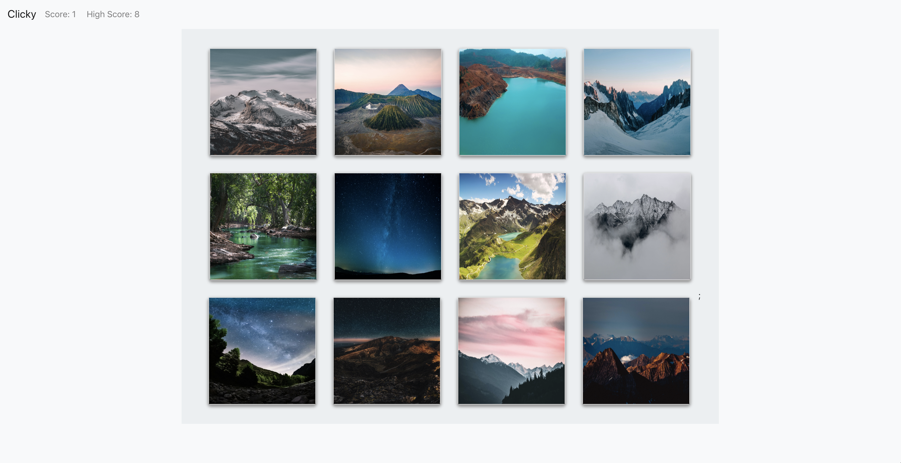

# Clicky

This is a simple game that uses the react framework. 

### How to Play
To play, just click on a card. Each time a card is clicked, the cards are then shuffled. The idea is to not click the same card twice. If a card is clicked twice, you score goes back to 0 and the game starts over.

#### Deployed Site

https://mgilliland23.github.io/clicky/

